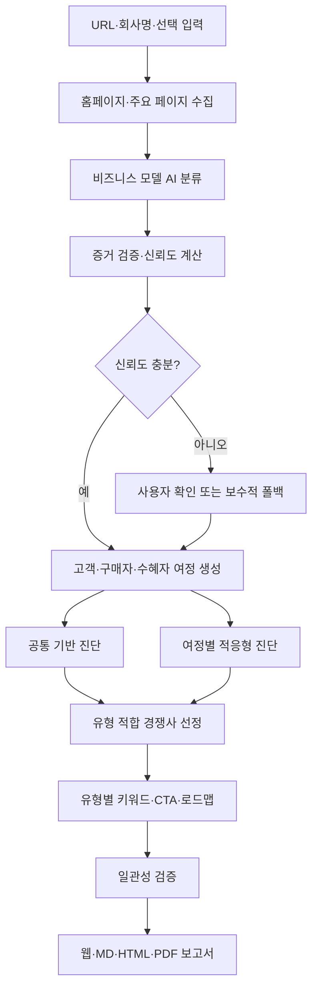

# PRD: 비즈니스 모델 적응형 AI 온라인 마케팅 사전진단 v4

> 문서 상태: 구현 준비 완료  
> 버전: 1.0  
> 작성일: 2026-07-19  
> 대상 저장소: `charlychoi/diagonse`  
> 주요 실행 환경: ChatGPT Work/Codex, Claude Code, 로컬 Mac, ChatGPT Sites  
> 기준 언어: 한국어  
> 제품명: AI 온라인 마케팅 사전진단

---

## 0. 이 문서의 사용 방법

이 문서는 비즈니스 모델 적응형 진단 v4 구현의 단일 기준 문서다. ChatGPT Work/Codex와 Claude Code는 이 문서를 읽은 뒤 현재 저장소를 분석하고, 아래 단계·데이터 계약·완료 조건을 기준으로 구현한다.

규범 표현은 다음 의미로 사용한다.

- **MUST**: 반드시 구현해야 한다.
- **MUST NOT**: 절대 구현하거나 허용하면 안 된다.
- **SHOULD**: 특별한 기술적 사유가 없다면 구현한다.
- **MAY**: 일정과 위험을 고려해 선택적으로 구현한다.

에이전트는 구현 전에 현재 코드와 이 문서의 차이를 목록화하고, 구현 후 테스트 결과와 남은 제한을 기록해야 한다. 기존 동작과 이 문서가 충돌하면 이 문서의 v4 요구사항을 우선한다.

---

## 1. 배경과 문제 정의

현재 제품은 홈페이지 URL과 회사명을 입력받아 브랜드, 콘텐츠·SEO, UX·전환, 소셜·유료 미디어, 권위·AI 검색 등을 진단한다. 그러나 기업의 비즈니스 모델을 판별하기 전에 모든 사이트에 동일한 B2C 서비스형 전환 기준을 적용한다.

현재 기준은 다음 행동을 모든 기업의 핵심 전환으로 가정한다.

- 전화 상담
- 카카오·네이버 상담
- 즉시 예약
- 신청 폼
- 모바일 `tel:` 링크
- 소셜 채널 연결
- 후기·가격·신청 방법 중심 키워드

이 기준은 병원동행, 로컬 서비스, 학원, 미용, 예약 서비스 같은 B2C 기업에는 유효할 수 있다. 하지만 다음 기업에는 부정확하거나 반대 방향의 권고를 만든다.

- 대기업·기관을 고객으로 하는 B2B 기업
- 지자체·공공기관 사업을 수행하는 B2G 기업
- 구매자와 최종 수혜자가 다른 B2B2C/B2G2C 기업
- 온라인 쇼핑몰·D2C 기업
- SaaS·구독 서비스
- 양면 플랫폼·마켓플레이스
- 비영리·협회·공익사업 조직
- 여러 사업 모델이 공존하는 복합 기업

### 1.1 대표 실패 사례: 상상우리

상상우리는 대기업·공공기관·지자체와 중장년 일자리·교육·연구 사업을 수행하며, 중장년 개인은 주요 수혜자이자 일부 프로그램의 직접 참여자다. 즉, `B2B + B2G + B2B2C/B2G2C`가 결합된 다중 고객 구조다.

기존 보고서는 상상우리를 개인이 즉시 서비스를 신청하는 B2C 기업처럼 해석해 다음 결과를 만들었다.

- “가장 큰 위험: 방문자가 무엇을 신청해야 하는지 모릅니다.”
- 전화·카카오·예약·폼이 없다는 이유로 전환 점수 13점
- 소셜 링크가 없다는 이유로 소셜·유료 미디어 6점
- “B2B는 부가 사업이므로 메인 title에서 분리” 권고
- 실제 서비스가 아닌 “중장년 경험”을 구매 키워드로 취급
- “중장년 경험 신청 방법·후기·전화 상담” 같은 부자연스러운 문구 생성

이는 일부 문구의 문제가 아니라 **채점 전제와 실행 순서가 잘못된 구조적 오류**다.

### 1.2 현재 파이프라인의 구조적 결함

현재 구현은 대체로 다음 순서로 작동한다.

1. 홈페이지 수집
2. 키워드 휴리스틱/AI 생성
3. 고정된 5개 축 채점
4. 종합점수와 등급 확정
5. B2C형 전환·광고 준비도 계산
6. AI 사전분석과 경쟁사 검색
7. 보고서 생성

AI가 기업을 B2B/B2G로 이해하더라도 점수와 핵심 결론이 이미 정해진 뒤다. v4에서는 AI 분류와 증거 검증이 모든 유형별 채점보다 먼저 실행되어야 한다.

---

## 2. 제품 비전

기업의 홈페이지와 공개 정보를 바탕으로 **누가 구매하고, 누가 사용하며, 어떤 방식으로 계약·구매·참여하는지 먼저 파악한 뒤**, 해당 비즈니스에 맞는 온라인 마케팅 준비도를 진단한다.

제품은 더 이상 모든 기업에 하나의 전환 공식을 적용하지 않는다. 공통 기반 점수와 비즈니스 모델별 고객 여정 점수를 분리하고, 관련 없는 항목은 감점하지 않는다.

---

## 3. 목표

### 3.1 핵심 목표

1. AI 또는 안전한 규칙 기반 분류기로 기업의 비즈니스 성격을 채점 전에 판별한다.
2. 단일 라벨이 아닌 주 모델·보조 모델·구매자·사용자·수익 방식·전환 목표를 구조화한다.
3. 비즈니스 모델에 따라 진단 항목, 가중치, 핵심 CTA, 키워드, 경쟁사, 실행 로드맵을 변경한다.
4. 혼합형 기업은 고객 여정별로 별도 점수를 제공한다.
5. 관련 없는 항목은 `N/A(해당 없음)`로 처리하고 점수 분모에서 제외한다.
6. AI 미사용·실패 시에도 과도한 단정을 피하는 안전한 폴백을 제공한다.
7. 보고서 첫 페이지에서 “왜 이 기준으로 평가했는지”를 사용자가 확인하고 수정할 수 있게 한다.

### 3.2 성공 기준

- 상상우리 진단에서 주 모델이 B2B/B2G, 보조 모델이 B2B2C/B2G2C로 분류된다.
- 상상우리의 핵심 전환을 전화·카카오·예약이 아니라 기관 제안 문의, 사업 사례 확인, 파트너십, 참여자 프로그램 경로로 평가한다.
- B2B가 title 희석 요소로 취급되지 않는다.
- 쇼핑몰에는 장바구니·결제·배송·환불 기준이 적용된다.
- B2C 로컬 서비스에는 예약·전화·리뷰·지도 기준이 적용된다.
- SaaS에는 데모·무료체험·가격·보안·도입 사례 기준이 적용된다.
- 동일 사이트라도 목표 고객 여정이 다르면 별도 점수를 제공한다.
- AI 분류 신뢰도가 낮으면 임시 종합 등급을 확정하지 않는다.

---

## 4. 비목표

v4는 다음을 직접 측정하거나 보장하지 않는다.

- 실제 매출, 광고 ROAS, CAC, LTV
- 네이버·구글 검색 순위 보장
- 실제 CRM 리드 품질
- 입찰 수주 가능성
- 결제 성공률 또는 실제 폼 제출 성공률
- 비공개 분석 데이터
- 기업의 법적·재무적 건전성
- AI 판단만으로 확정하는 경영 컨설팅

이 항목은 공개 표면 진단과 구분해 `직접 확인 필요`로 표시한다.

---

## 5. 설계 원칙

1. **분류 후 채점**: 비즈니스 모델 분류가 모든 유형별 진단보다 먼저다.
2. **다중 라벨**: 기업을 B2B 또는 B2C 하나로만 단정하지 않는다.
3. **구매자와 사용자를 분리**: 계약자, 의사결정자, 사용자, 수혜자를 구분한다.
4. **전환은 비즈니스별로 다르다**: 구매, 예약, 제안 문의, 입찰, 회원가입, 기부 등은 서로 다른 전환이다.
5. **N/A는 실패가 아니다**: 관련 없는 기능이 없다고 감점하지 않는다.
6. **증거 우선**: AI 분류에는 URL·문구·사업 페이지·공식 공개 출처 근거가 따라야 한다.
7. **불확실성 공개**: 신뢰도와 대안 가설을 사용자에게 보여준다.
8. **사용자 수정 가능**: 자동 분류가 틀리면 한 번의 선택으로 정정할 수 있어야 한다.
9. **AI는 선택하고, 규칙은 계산한다**: AI는 유형·목표·근거를 구조화하고 결정적 계산은 코드가 수행한다.
10. **표면 신호와 성과를 혼동하지 않는다**: 홈페이지 준비도와 실제 사업 성과를 구분한다.

---

## 6. 사용자와 주요 사용 사례

### 6.1 사용자

- 기업 대표·마케팅 담당자
- 온라인 마케팅 컨설턴트
- 광고 대행사
- 웹 제작사
- 공공·지원사업 컨설턴트
- GitHub 저장소를 복제해 사용하는 개발자

### 6.2 핵심 사용 사례

1. URL과 회사명만으로 비즈니스 모델을 자동 판별한다.
2. 판별 결과와 근거를 확인하고 필요하면 수정한다.
3. 자사에 맞는 핵심 고객 여정별 진단을 받는다.
4. 같은 모델의 경쟁사를 자동 선정해 비교한다.
5. 고객 유형에 맞는 SEO 키워드와 CTA를 받는다.
6. AI가 없을 때는 제한된 규칙 기반 진단을 받는다.
7. Markdown, HTML, PDF로 같은 의미의 보고서를 내보낸다.

---

## 7. 비즈니스 모델 분류 체계

### 7.1 시장 관계 `marketMotions`

복수 선택을 허용한다.

| 코드 | 의미 | 대표 예시 |
| --- | --- | --- |
| `b2c_service` | 개인 대상 서비스 | 병원동행, 학원, 상담, 로컬 서비스 |
| `b2b_service` | 기업 대상 서비스·용역 | 컨설팅, 기업교육, 제작, 전문 서비스 |
| `b2g` | 정부·공공기관 대상 | 연구용역, 정책사업, 위탁운영 |
| `b2b2c` | 기업이 구매하고 개인이 사용 | 임직원 복지, 기업 제공 교육 |
| `b2g2c` | 공공기관이 구매하고 시민이 수혜 | 지자체 교육·일자리 프로그램 |
| `d2c_ecommerce` | 자체 상품 온라인 판매 | 브랜드 쇼핑몰 |
| `retail_ecommerce` | 여러 상품 온라인 판매 | 전문몰, 종합몰 |
| `saas` | 소프트웨어 구독 | 업무 도구, 플랫폼 SaaS |
| `marketplace` | 공급자·수요자 중개 | 채용·전문가·예약 플랫폼 |
| `membership_community` | 회원·커뮤니티 | 협회, 유료 커뮤니티 |
| `media_content` | 콘텐츠·미디어 | 뉴스, 교육 콘텐츠, 출판 |
| `nonprofit_public_interest` | 비영리·공익 | 재단, 사회적 프로젝트 |
| `hybrid` | 위 모델 2개 이상이 핵심 | 복합 기업 |
| `unknown` | 근거 부족 | 분류 보류 |

### 7.2 구매·계약 방식 `revenueMotions`

- `instant_purchase`
- `reservation_payment`
- `quote_and_contract`
- `project_contract`
- `public_procurement`
- `subscription`
- `commission`
- `advertising_sponsorship`
- `membership_fee`
- `grant_donation`
- `free_public_program`
- `mixed`
- `unknown`

### 7.3 고객 역할

- `economicBuyer`: 예산을 승인하거나 비용을 지불하는 주체
- `decisionMaker`: 최종 선정·계약 담당자
- `influencer`: 검토·추천에 영향을 주는 주체
- `endUser`: 실제 제품·서비스 사용자
- `beneficiary`: 사업의 최종 수혜자
- `supplierPartner`: 플랫폼 공급자·협력사

### 7.4 사이트 역할 `siteRoles`

- `corporate_credibility`
- `lead_generation`
- `proposal_support`
- `program_recruitment`
- `ecommerce_sales`
- `product_signup`
- `marketplace_matching`
- `content_discovery`
- `customer_support`
- `investor_recruiting`
- `mixed`

### 7.5 전환 목표 `conversionGoals`

| 코드 | 설명 |
| --- | --- |
| `buy_now` | 즉시 상품 구매 |
| `add_to_cart` | 장바구니 |
| `book_service` | 예약 |
| `call_or_chat` | 전화·메신저 상담 |
| `request_quote` | 견적 문의 |
| `request_proposal` | 사업 제안·제안서 요청 |
| `contact_sales` | 영업·도입 상담 |
| `download_company_profile` | 소개서·제안서 다운로드 |
| `view_case_study` | 사례·성과 확인 |
| `apply_program` | 프로그램 신청 |
| `register_jobseeker` | 구직자 등록 |
| `register_employer` | 기업·채용 등록 |
| `start_trial` | 무료체험 |
| `create_account` | 회원가입 |
| `subscribe_content` | 뉴스레터·콘텐츠 구독 |
| `partner_inquiry` | 제휴·협력 문의 |
| `donate` | 후원·기부 |

---

## 8. 핵심 데이터 계약

### 8.1 `BusinessProfile`

```ts
export type BusinessProfile = {
  version: "1.0";
  primaryMarketMotion: MarketMotion;
  secondaryMarketMotions: MarketMotion[];
  isHybrid: boolean;
  revenueMotions: RevenueMotion[];
  siteRoles: SiteRole[];
  audiences: AudienceProfile[];
  journeys: CustomerJourney[];
  primaryObjectiveId: string | null;
  confidence: number; // 0..1
  confidenceLabel: "high" | "medium" | "low";
  evidence: ClassificationEvidence[];
  alternativeHypotheses: AlternativeHypothesis[];
  source: "ai_web" | "ai_site_only" | "heuristic" | "user_override";
  needsConfirmation: boolean;
};

export type AudienceProfile = {
  id: string;
  label: string;
  roles: Array<
    "economicBuyer" |
    "decisionMaker" |
    "influencer" |
    "endUser" |
    "beneficiary" |
    "supplierPartner"
  >;
  organizationType?: string;
  needs: string[];
  expectedProof: string[];
};

export type CustomerJourney = {
  id: string;
  label: string;
  audienceId: string;
  marketMotion: MarketMotion;
  objective: ConversionGoal;
  priority: "primary" | "secondary" | "supporting";
  buyingCycle: "instant" | "short" | "long" | "procurement" | "unknown";
  expectedCtas: string[];
  expectedEvidence: string[];
};

export type ClassificationEvidence = {
  claim: string;
  evidenceText: string;
  sourceUrl: string;
  sourceType: "homepage" | "service_page" | "official_external";
  strength: "strong" | "medium" | "weak";
};
```

### 8.2 진단 상태 확장

```ts
export type DiagnosticStatus =
  | "pass"
  | "warn"
  | "fail"
  | "manual"
  | "not_applicable"
  | "not_observed";
```

- `not_applicable`: 해당 비즈니스·여정에는 필요하지 않음. 분모에서 제외.
- `not_observed`: 필요할 가능성은 있으나 공개 페이지에서 확인되지 않음. 자동 실패로 단정하지 않음.
- `manual`: 실제 제출·결제·계약 과정 등 직접 확인 필요.

### 8.3 점수 구조

```ts
export type AdaptiveDiagnosisScores = {
  coreReadiness: ScoreCard;
  journeyScores: JourneyScoreCard[];
  primaryJourneyScore: number | null;
  overallScore: number | null;
  grade: "A" | "B" | "C" | "D" | "F" | null;
  provisional: boolean;
  confidence: number;
  scoringProfileId: string;
};
```

`confidence < 0.65`이거나 `needsConfirmation === true`이면 `overallScore`와 `grade`는 임시값으로 표시하거나 `null` 처리한다. UI에는 “비즈니스 유형 확인 후 확정”이라고 표시한다.

---

## 9. 목표 파이프라인



### 9.1 실행 순서 MUST

1. 요청 검증
2. 사이트 수집
3. 비즈니스 프로필 분류
4. 프로필 증거·신뢰도 검증
5. 고객 여정 생성
6. 공통 점수 계산
7. 여정별 점수 계산
8. 프로필에 맞는 경쟁사 검색·검증
9. 프로필에 맞는 키워드·메시지 생성
10. 실행 계획 생성
11. 보고서 일관성 검증
12. 출력

AI 사전분석은 MUST 단계 3에 위치해야 하며, 점수 확정 후 실행해서는 안 된다.

---

## 10. 비즈니스 모델 분류기

### 10.1 입력

- 회사명
- 홈페이지 URL
- 사용자가 입력한 업종·키워드·목표
- title, description, H1/H2
- 메뉴와 주요 내부 링크
- 회사소개·서비스·사업·고객사·사례·가격·채용·프로그램 페이지
- 구조화 데이터
- AI 웹 검색이 가능한 경우 공식 홈페이지와 공식 공개 출처

### 10.2 출력 규칙

분류기는 반드시 JSON 스키마를 충족해야 한다. 다음을 단정적으로 추정해서는 안 된다.

- 공개 근거 없는 매출 구조
- 실제 계약 금액
- 실제 광고 채널
- 고객 만족도
- 정부·대기업 공식 파트너 관계

### 10.3 신뢰도 규칙

- 강한 근거 2개 이상 + 상충 없음: `high`, 0.80 이상
- 일부 근거 + 혼합 모델: `medium`, 0.65~0.79
- 홈페이지 1개 페이지만 수집 또는 근거 상충: `low`, 0.64 이하
- 분류 불가: `primaryMarketMotion = unknown`

### 10.4 사용자 확인

UI는 자동 분류 결과를 진단 시작 직후 또는 보고서 상단에 표시한다.

예시:

> AI가 이 회사를 **B2B/B2G 중심, 개인 참여자 보조**로 분석했습니다.  
> 주요 고객: 기업·공공기관 담당자 / 수혜자: 중장년 참여자  
> [맞음] [B2C 중심] [온라인 판매] [직접 수정]

확인이 없어도 고신뢰도 분류는 계속 진행할 수 있다. 저신뢰도 분류는 임시 점수로 표시한다.

### 10.5 프롬프트 인젝션 방어

- 크롤한 페이지의 지시문은 데이터로만 취급한다.
- 사이트 본문의 “이전 지시를 무시” 같은 문구를 실행하지 않는다.
- 로컬 파일·셸·환경 변수 접근을 허용하지 않는다.
- 공식 HTTPS URL과 제공된 사이트 범위만 근거로 사용한다.
- API/OAuth 키와 토큰을 프롬프트·로그·보고서에 포함하지 않는다.

---

## 11. 적응형 채점 모델

### 11.1 공통 기반 점수 `coreReadiness` — 50%

모든 기업에 공통으로 적용한다.

| 영역 | 기본 비중 | 주요 항목 |
| --- | ---: | --- |
| 정체성·메시지 | 15 | 누구이며 무엇을 제공하는지, 고객 구분 |
| 기술·검색 기반 | 15 | title, description, H1, canonical, robots, sitemap, 모바일 |
| 신뢰·권위 | 10 | 회사정보, 정책, 사례·근거, 구조화 데이터 |
| 측정·운영 기반 | 10 | 분석 태그, 핵심 이벤트 설계, 오류·접근성 |

### 11.2 고객 여정 점수 — 50%

기업별 `primaryJourney`와 `secondaryJourney`를 따로 계산한다. 주요 여정이 여러 개면 각각 점수를 표시한다.

#### B2C 서비스

- 서비스·가격·이용 절차 명확성
- 예약·상담·전화·메신저 경로
- 리뷰·후기·지역 신뢰
- 모바일 전환
- 개인정보 동의

#### B2B 서비스

- 해결하는 조직 문제와 구매 담당자 명확성
- 서비스 범위·수행 방식
- 고객사·사례·성과·전문성
- 제안·견적·영업 문의
- 회사소개서·사례 다운로드
- 긴 구매 주기 리드 측정
- LinkedIn·이메일·세미나 등 관계형 채널 적합성

전화·카카오·즉시 예약은 기본 필수 항목이 아니다.

#### B2G

- 공공 과제·정책 문제와 수행 역량
- 사업 수행 사례·발주기관·기간·성과
- 연구·위탁·교육·운영 범위
- 인증·등록·법인 정보
- 제안·협력·용역 문의
- 공공 담당자용 자료
- 접근성·개인정보·공공 신뢰

#### B2B2C/B2G2C

- 구매자와 수혜자 메시지 분리
- 기관 제안 경로와 참여자 신청 경로 분리
- 프로그램별 대상·자격·일정·신청
- 기관 성과와 참여자 경험의 이중 근거
- 별도 플랫폼으로 이동할 때 역할과 목적 설명

#### 이커머스

- 카테고리·검색·상품 발견
- 상품 상세, 가격, 옵션, 재고
- 장바구니·결제
- 배송·교환·환불·고객지원
- 리뷰·신뢰·결제 보안
- 전자상거래 이벤트 측정

전화 상담 폼이 없어도 감점하지 않는다.

#### SaaS·구독

- 문제·대상·제품 가치
- 제품 화면·기능·통합
- 가격·무료체험·데모
- 도입 사례·보안·개인정보
- 회원가입·온보딩
- 체험→활성→유료화 이벤트

#### 플랫폼·마켓플레이스

- 공급자·수요자 경로 분리
- 가입·등록·검색·매칭
- 검증·안전·수수료·정책
- 양쪽 전환 이벤트
- 유동성·활성 지표는 직접 확인 항목

#### 콘텐츠·커뮤니티·비영리

- 미션·대상·콘텐츠 구조
- 구독·회원·참여·기부 경로
- 투명성·성과·운영 주체
- 재방문·구독 이벤트

### 11.3 N/A 처리

- 각 체크는 먼저 `applicability`를 평가한다.
- `not_applicable`은 점수 분모에서 제외한다.
- N/A 비율이 40%를 넘으면 해당 점수표 자체를 숨기거나 다른 프로필을 선택한다.
- 적용 항목이 3개 미만이면 숫자 점수를 생성하지 않고 서술형으로 대체한다.

### 11.4 종합점수

- 고신뢰도 단일 주 여정: 공통 50% + 주 여정 50%
- 혼합형: 공통 점수 + 여정별 점수를 별도로 표시하며 단일 종합점수는 보조값으로만 제공
- 저신뢰도: 등급 확정 금지
- 점수보다 `진단 프로필`, `여정별 병목`, `근거`를 먼저 표시

---

## 12. 유형별 전환 정의

### 12.1 상상우리 예시

| 고객 여정 | 핵심 사용자 | 올바른 전환 | 잘못된 일괄 기준 |
| --- | --- | --- | --- |
| 기관 사업 | 기업·공공 담당자 | 사업 사례 보기, 제안 문의, 소개서 | 카카오 즉시 상담 |
| 프로그램 참여 | 중장년 개인 | 모집 프로그램 보기, 신청 | 홈페이지 전체 단일 신청 |
| 일자리 매칭 | 구직자·기업 | 워크위즈 이동, 구직/기업 등록 | 전화 예약 |
| 연구·교육 | 기관 담당자 | 연구·교육 범위, 수행 사례, 용역 문의 | 가격·후기 검색 |

### 12.2 전환 평가 규칙

전환의 존재 여부뿐 아니라 다음을 확인한다.

- CTA 문구가 대상 고객을 명시하는가?
- CTA가 올바른 여정으로 연결되는가?
- 긴 구매 주기에는 충분한 증거와 다음 단계가 있는가?
- 외부 플랫폼 이동 시 목적이 설명되는가?
- 여러 고객 여정이 서로 혼동되지 않는가?
- 측정 이벤트가 여정별로 설계됐는가?

---

## 13. 경쟁사 자동 선정 재설계

### 13.1 경쟁사 일치 조건

경쟁사는 단순히 같은 키워드를 쓰는 회사가 아니라 다음 조건을 비교해야 한다.

- 동일하거나 인접한 `marketMotion`
- 동일한 경제적 구매자
- 유사한 계약·구매 방식
- 유사한 핵심 제공 가치
- 유사한 지역·시장 범위

### 13.2 후보 유형

- `direct`: 같은 구매자와 같은 서비스
- `alternative`: 같은 문제를 다른 방식으로 해결
- `benchmark`: 직접 경쟁자는 아니지만 온라인 구조가 우수

보고서는 후보 유형과 선정 이유를 표시한다. 공공기관 자체를 민간 수행기업의 직접 경쟁사로 자동 간주하지 않는다. 공공기관은 `benchmark` 또는 `ecosystem`으로 분리할 수 있다.

### 13.3 비교 항목

비교 항목도 프로필별로 바뀌어야 한다.

- B2B/B2G: 사례, 고객사, 성과, 수행 범위, 제안 경로
- B2C: 가격, 예약, 리뷰, 지역 정보
- 이커머스: 상품 발견, 상세, 결제, 배송·환불
- SaaS: 기능, 가격, 데모, 보안, 도입 사례
- 플랫폼: 양면 가입, 매칭, 신뢰·검증

---

## 14. 키워드·메시지 전략 재설계

### 14.1 금지 규칙

- 모든 서비스에 자동으로 `비용`, `추천`, `신청 방법`, `후기`를 붙이지 않는다.
- `중장년 경험`처럼 추상적 슬로건을 검증 없이 상품명으로 만들지 않는다.
- B2B를 title 희석 요소로 간주하지 않는다.
- 확인되지 않은 “전문”, “검증된”, “1위”, “성과”를 자동 삽입하지 않는다.
- 전화·카카오를 모든 CTA의 기본값으로 사용하지 않는다.

### 14.2 유형별 검색 의도

#### B2B/B2G

- 문제·과제형: `중장년 전직지원 사업 운영`
- 구매자형: `공공기관 중장년 교육 위탁`
- 용역형: `중장년 일자리 연구용역`
- 사례형: `퇴직자 전직지원 프로그램 사례`
- 파트너형: `중장년 일자리 사업 협력사`

#### B2C

- 지역·서비스·가격·예약·후기·상황형

#### 이커머스

- 제품명·카테고리·용도·비교·구매·배송형

#### SaaS

- 문제·기능·대안·가격·통합·보안·도입형

### 14.3 메시지 생성

메시지는 다음 구조를 입력받아야 한다.

- 대상 고객
- 해결할 문제
- 제공 방식
- 기대 결과
- 사실에 근거한 증거
- 여정에 맞는 CTA

혼합 기업은 고객별 H1/서브카피/CTA를 하나로 억지로 합치지 않고 정보 구조 또는 분기 CTA를 제안한다.

---

## 15. 보고서 정보 구조 v4

### 15.1 첫 페이지 MUST

1. 회사명과 진단 대상 URL
2. AI가 판별한 비즈니스 모델
3. 구매자·사용자·수혜자 구조
4. 판별 신뢰도와 핵심 근거
5. 주 고객 여정과 핵심 전환
6. 공통 기반 점수
7. 여정별 점수
8. 가장 큰 위험 — 해당 비즈니스에 맞는 표현

### 15.2 권장 목차

1. 비즈니스 모델 판별
2. 고객·구매자·수혜자 지도
3. 핵심 고객 여정
4. 공통 온라인 기반
5. 여정별 전환 준비도
6. 검색·콘텐츠 전략
7. 경쟁사·벤치마크 비교
8. 우선순위와 30·60·90일 계획
9. 적용 제외·직접 확인 항목
10. 방법론·신뢰도·출처

### 15.3 상상우리의 올바른 요약 예시

> **기관 파트너 대상 사업 설명과 실적 근거는 있으나, 고객 여정 분리가 부족합니다.**
>
> 상상우리는 대기업·공공기관과 함께 중장년 일자리·교육 사업을 수행하는 B2B/B2G 중심 기업이며, 중장년 개인은 주요 수혜자이자 일부 프로그램의 직접 참여자입니다.
>
> 가장 큰 위험은 개인이 무엇을 즉시 신청해야 하는지 모르는 것이 아니라, **기관 담당자·프로그램 참여자·협력기업이 각자 어디로 이동해야 하는지 첫 화면에서 명확히 구분되지 않는 것**입니다.
>
> 우선순위는 `기관·기업 사업 제안`, `사업 사례·성과`, `중장년 프로그램 참여`, `워크위즈 이용` 경로를 분리하는 것입니다.

### 15.4 금지되는 보고서 표현

- 분류 근거 없이 “고객 전환 구조가 약하다” 단정
- B2B에 “전화·카카오가 없으므로 취약” 단정
- 이커머스에 “문의 폼이 없으므로 취약” 단정
- 공공 수행기업에 “소셜이 없으므로 광고 준비 미흡” 단정
- 혼합 기업에 단일 고객만 존재하는 것처럼 표현
- N/A 항목을 0점으로 계산

---

## 16. UI 요구사항

### 16.1 입력 화면

기존 URL·회사명 중심의 간단함을 유지한다. 선택 입력으로 다음을 제공한다.

- 주요 마케팅 목표
- 알고 있는 고객 유형
- 업종
- 핵심 서비스

사용자가 입력하지 않아도 AI 자동 분류를 수행한다.

### 16.2 분류 확인 카드

- 주 모델·보조 모델
- 주요 구매자·수혜자
- 핵심 여정
- 신뢰도
- 판단 근거 2~4개
- `맞습니다` 및 `수정` 액션

### 16.3 결과 화면

- 단일 레이더 차트만 사용하지 않는다.
- 공통 점수와 여정 점수를 분리한다.
- `해당 없음`, `확인되지 않음`, `직접 확인`을 색과 텍스트로 구분한다.
- 점수보다 비즈니스 모델과 고객 여정을 먼저 보여준다.
- PDF/HTML/Markdown이 같은 분류와 결론을 유지해야 한다.

---

## 17. API 변경

### 17.1 요청 v4

```json
{
  "url": "https://example.com",
  "company": "회사명",
  "industry": "선택",
  "keywords": ["선택"],
  "primaryObjective": "선택",
  "businessProfileOverride": {
    "primaryMarketMotion": "b2b_service",
    "secondaryMarketMotions": ["b2g"]
  }
}
```

### 17.2 응답 v4

```json
{
  "ok": true,
  "version": "4.0.0",
  "businessProfile": {},
  "scores": {
    "coreReadiness": {},
    "journeyScores": [],
    "overallScore": null,
    "provisional": true
  },
  "executiveSummary": {},
  "competitorComparison": {},
  "keywordStrategy": {},
  "roadmap": [],
  "methodology": {},
  "markdown": "..."
}
```

### 17.3 호환성

- 기존 `/api/diagnose` 경로를 유지한다.
- 응답 `version`을 `4.0.0`으로 올린다.
- 기존 필드는 한 릴리스 동안 deprecated alias로 유지할 수 있다.
- UI와 보고서는 신규 필드를 사용해야 한다.
- 구버전 단일 `surfaceScore`는 `legacySurfaceScore`로만 제공하고 주요 화면에서 숨긴다.

---

## 18. AI 실행과 폴백

### 18.1 AI 사용 시

AI는 다음 역할을 수행한다.

1. 비즈니스 모델 분류
2. 고객·구매자·수혜자 추출
3. 고객 여정 후보 생성
4. 공식 근거와 경쟁사 후보 검색
5. 유형에 맞는 메시지·키워드 초안

점수 계산과 N/A 처리는 코드의 프로필 규칙이 담당한다.

### 18.2 AI 미사용 시

- 구조화 데이터, 메뉴, 가격, 장바구니, 프로그램, 고객사, 공공기관, 도입 사례 등의 신호로 휴리스틱 분류한다.
- `confidenceLabel = low`를 기본으로 한다.
- 단일 종합 등급을 확정하지 않는다.
- 사용자가 유형을 확인하도록 안내한다.
- B2C 기본값으로 자동 폴백하지 않는다.
- 확인되지 않은 경쟁사·키워드·CTA를 만들지 않는다.

### 18.3 공급자 독립성

- Claude, OpenAI, Gemini, Grok API 중 복제 사용자가 자신의 키를 선택할 수 있어야 한다.
- Mac 로컬에서는 로그인된 Grok/Codex OAuth CLI를 사용할 수 있다.
- 공급자별 응답은 동일 JSON 스키마로 정규화한다.
- 공개 Sites에는 저장소 소유자의 개인 API/OAuth 자격 증명을 넣지 않는다.

---

## 19. 구현 설계

### 19.1 신규 모듈 권장

| 파일 | 역할 |
| --- | --- |
| `lib/business-profile-types.ts` | 분류 타입·스키마 |
| `lib/business-classifier.ts` | AI/휴리스틱 분류 오케스트레이션 |
| `lib/business-classifier-prompt.ts` | 분류 프롬프트 |
| `lib/business-profile-validator.ts` | JSON·근거·신뢰도 검증 |
| `lib/journey-builder.ts` | 고객 여정 생성 |
| `lib/scoring/common-score.ts` | 공통 기반 점수 |
| `lib/scoring/profile-registry.ts` | 유형별 프로필 등록 |
| `lib/scoring/journey-score.ts` | 여정별 N/A 포함 계산 |
| `lib/scoring/profiles/*.ts` | B2C/B2B/B2G/이커머스/SaaS 등 |
| `lib/adaptive-keyword-strategy.ts` | 유형별 검색 의도·문구 |
| `lib/adaptive-competitors.ts` | 구매자·모델 일치 경쟁사 |
| `lib/report-v4.ts` | 신규 보고서 |
| `lib/diagnosis-consistency.ts` | 분류·점수·문구 모순 검사 |

### 19.2 기존 모듈 변경

- `lib/analyzer.ts`
  - 분류를 점수 계산 전으로 이동한다.
  - `BusinessProfile`과 `CustomerJourney[]`를 모든 후속 모듈에 전달한다.
- `lib/conversion-diagnosis.ts`
  - `signals`만 받는 함수를 제거하거나 deprecated 처리한다.
  - `profile`, `journey`를 필수로 받는다.
- `lib/ad-readiness.ts`
  - 광고 목적과 여정에 따라 체크를 구성한다.
- `lib/hero-diagnosis.ts`
  - 다중 고객 분기와 역할 명확성을 평가한다.
- `lib/score-reliability.ts`
  - 고정 가중치·CTA/폼 상한을 제거하고 프로필별 가중치를 적용한다.
- `lib/ai-strategy.ts`
  - `비용·추천·후기·신청 방법` 자동 생성 규칙을 제거한다.
- `lib/seo-playbook.ts`
  - `B2B`를 희석 요소로 보는 규칙을 제거한다.
- `lib/competitor-comparison.ts`
  - 비즈니스 모델·구매자·계약 방식 일치를 검증한다.
- `lib/types.ts`, `lib/auto-diagnose.ts`
  - v4 응답 계약을 추가한다.
- `app/DiagnoseApp.tsx`
  - 분류 확인 카드와 여정별 점수를 추가한다.
- `USER_MANUAL.md`
  - 유형별 기준과 AI/비AI 차이를 갱신한다.

### 19.3 제거 또는 비활성화할 규칙

- B2B를 title 희석 신호로 간주
- CTA·폼 부재 시 모든 기업 점수 상한 62
- 소셜 링크 부재를 모든 기업의 고정 대감점으로 사용
- 모든 기업에 전화·카카오·예약 요구
- 모든 키워드에 비용·추천·후기·신청 방법 자동 결합
- AI 분석을 종합점수 확정 후 실행

---

## 20. 일관성 검증기

보고서 생성 직전에 다음 규칙을 검사한다.

- 주 모델이 B2B/B2G인데 B2C 전용 항목이 실패로 계산됐는가?
- 주 모델이 이커머스인데 장바구니·결제가 평가되지 않았는가?
- B2B가 부가 사업 또는 희석 요소로 표현됐는가?
- 구매자와 수혜자가 다른데 단일 고객으로 표현됐는가?
- 키워드가 실제 서비스가 아닌 추상 슬로건인가?
- 경쟁사가 다른 시장 관계를 갖는가?
- 보고서 요약과 점수 근거가 충돌하는가?
- `not_applicable` 항목이 분모에 포함됐는가?
- 저신뢰도인데 확정 등급이 표시됐는가?

치명적 모순이 있으면 보고서 생성을 실패시키지 말고 해당 섹션을 보수적 문구와 `확인 필요` 상태로 대체하며 오류를 내부 로그에 기록한다.

---

## 21. 테스트 전략

### 21.1 단위 테스트

- 분류 JSON 스키마 검증
- 다중 라벨과 신뢰도 계산
- N/A 분모 제외
- 프로필별 가중치 합계 100 검증
- 고객 여정별 CTA 매핑
- 경쟁사 모델 일치 필터
- 유형별 키워드 생성
- 폴백 시 확정 등급 금지

### 21.2 필수 회귀 테스트

#### 상상우리

MUST 결과:

- `primaryMarketMotion`: `b2b_service` 또는 `b2g`
- 보조 모델에 `b2g`, `b2b2c` 또는 `b2g2c`
- 기관 담당자와 중장년 수혜자 분리
- 전화·카카오·예약 부재를 핵심 실패로 계산하지 않음
- “무엇을 신청해야 하는지 모른다”를 가장 큰 위험으로 표시하지 않음
- B2B를 title에서 제거하라고 권고하지 않음
- `중장년 경험`을 검증 없이 핵심 상품명으로 사용하지 않음
- 기관 제안·사업 사례·프로그램 참여·워크위즈 경로 분리를 권고

#### B2C 병원동행

- 예약·전화·카카오·지역·후기 기준 적용
- 모바일 `tel:` 링크를 중요 항목으로 평가

#### 온라인 쇼핑몰

- 장바구니·결제·배송·교환·환불 평가
- 문의 폼 부재를 실패로 계산하지 않음

#### B2B SaaS

- 데모·무료체험·가격·보안·도입 사례 평가
- 카카오·지역 SEO를 기본 필수로 계산하지 않음

#### 양면 플랫폼

- 공급자와 수요자 여정 분리
- 단일 CTA가 아닌 양쪽 온보딩 평가

#### AI 비활성

- B2C로 강제 폴백하지 않음
- 낮은 신뢰도와 임시 진단 표시
- 규칙 기반 공통 점검은 정상 작동

### 21.3 통합 테스트

- API v4 응답 스키마
- 웹 화면과 Markdown 보고서 결론 일치
- HTML/PDF 출력의 분류·점수·N/A 일치
- AI 공급자별 같은 구조로 정규화
- 타임아웃·잘못된 JSON·검색 실패 폴백

### 21.4 품질 테스트

- 한국어 조사 오류: `상상우리은`, `경험이 필요` 같은 부자연스러운 문장 방지
- 확인되지 않은 수치·파트너·성과 생성 금지
- 같은 권고 반복 제한
- 보고서 첫 2페이지에서 모델과 핵심 여정 이해 가능

---

## 22. 수용 기준

다음 조건을 모두 충족해야 v4 완료로 본다.

1. 비즈니스 분류가 채점 전에 실행된다.
2. `BusinessProfile`과 고객 여정이 API·UI·보고서에 표시된다.
3. 최소 7개 시장 모델을 지원한다.
4. N/A가 점수 분모에서 제외된다.
5. 공통 점수와 여정별 점수가 분리된다.
6. 저신뢰도 진단은 확정 등급을 표시하지 않는다.
7. 상상우리 필수 회귀 테스트가 모두 통과한다.
8. B2C·B2B·B2G·이커머스·SaaS·플랫폼 픽스처 테스트가 통과한다.
9. AI 비활성 폴백이 과도한 B2C 단정을 하지 않는다.
10. GitHub와 Sites에 개인 API/OAuth 자격 증명이 없다.
11. `npm test`, `npm run build`, `npm run build:sites`가 통과한다.
12. 사용자 설명서가 v4 기준으로 갱신된다.

---

## 23. 구현 단계

### Phase 1 — 분류 기반

- 타입·JSON 스키마
- AI/휴리스틱 분류기
- 근거·신뢰도
- 사용자 확인 카드
- 상상우리 분류 테스트

### Phase 2 — 적응형 점수

- 공통 점수
- B2C, B2B, B2G, B2B2C/B2G2C 프로필
- N/A 처리
- 고정 가중치·상한 제거

### Phase 3 — 상거래·제품 모델

- 이커머스
- SaaS
- 플랫폼·마켓플레이스
- 콘텐츠·커뮤니티·비영리

### Phase 4 — 전략·비교·보고서

- 유형별 키워드
- 유형 적합 경쟁사
- v4 보고서
- 일관성 검증기
- 사용자 설명서

### Phase 5 — 검증·배포

- 전체 테스트
- 실제 대표 사이트 회귀 테스트
- PDF/HTML 시각 검수
- GitHub PR
- 명시적으로 요청받은 경우에만 Sites 배포

각 Phase는 독립 커밋이 가능해야 하며 이전 Phase의 테스트를 깨뜨리면 안 된다.

---

## 24. 에이전트 실행 지침

ChatGPT Work/Codex 또는 Claude Code는 다음 순서로 작업한다.

1. `AGENTS.md`, 이 PRD, 현재 `README.md`, `USER_MANUAL.md`를 읽는다.
2. 현재 코드와 PRD 요구사항의 차이를 `docs/V4_IMPLEMENTATION_PLAN.md`에 체크리스트로 작성한다.
3. 기존 테스트를 먼저 실행해 기준선을 기록한다.
4. Phase 1부터 순서대로 구현한다.
5. 각 Phase마다 타입 검사·단위 테스트를 실행한다.
6. 고정 B2C 가정을 제거할 때 기존 B2C 동작을 프로필 모듈로 이전한다.
7. 실제 API 키를 코드·테스트·문서·로그에 넣지 않는다.
8. 테스트에서는 mock 또는 로컬 OAuth를 사용하되 OAuth 토큰을 읽지 않는다.
9. 구현 결정과 PRD 차이가 있으면 `docs/V4_IMPLEMENTATION_LOG.md`에 이유를 기록한다.
10. 전체 완료 후 테스트·빌드·보안 검색 결과를 PR 본문에 기록한다.

### 24.1 구현 중 금지

- 기존 단일 점수를 이름만 바꿔 v4로 표시
- AI 프롬프트만 수정하고 채점 순서는 유지
- 상상우리 이름을 코드에 하드코딩해 테스트 통과
- B2B/B2G를 하나의 정규식으로만 확정
- AI 실패 시 B2C를 기본값으로 사용
- 실제 사용자 API 키를 테스트에 사용하거나 커밋
- 관련 없는 기존 변경을 삭제

---

## 25. 관측성과 로그

개인정보·비밀을 저장하지 않는 범위에서 다음을 기록할 수 있다.

- 분류 모델과 신뢰도
- 선택된 채점 프로필 ID
- 적용·N/A·미확인 체크 개수
- AI 분류 실패 유형
- 경쟁사 후보 탈락 이유
- 일관성 검증 경고 코드
- 처리 시간

원문 전체, API 키, OAuth 토큰, 개인 연락처는 로그에 저장하지 않는다.

---

## 26. 위험과 대응

| 위험 | 영향 | 대응 |
| --- | --- | --- |
| AI 오분류 | 잘못된 점수·권고 | 근거·신뢰도·사용자 수정·대안 가설 |
| 혼합 기업 단순화 | 중요한 여정 누락 | 다중 라벨·여정별 점수 |
| 웹 검색 오류 | 경쟁사·분류 왜곡 | 공식 출처 검증·사이트 전용 폴백 |
| 과도한 프로필 수 | 유지보수 복잡 | 공통 체크 + 프로필 등록 구조 |
| 구버전 API 의존 | 클라이언트 오류 | 한 릴리스 alias·버전 명시 |
| 점수 비교 단절 | 기존 보고서 혼란 | v3/v4 척도 비교 금지 안내 |
| AI 비용·지연 | UX 저하 | 분류 1회 재사용·캐시·타임아웃 |
| 프롬프트 인젝션 | 보안·품질 위험 | 사이트 본문 데이터 취급·도구 제한 |

---

## 27. 최종 제품 판단 기준

v4의 품질은 “얼마나 많은 항목을 검사했는가”가 아니라 다음 질문으로 판단한다.

1. 이 기업에서 실제로 돈을 지불하거나 계약하는 사람은 누구인가?
2. 실제 제품·서비스를 사용하는 사람은 누구인가?
3. 홈페이지가 수행해야 하는 가장 중요한 역할은 무엇인가?
4. 그 역할에 맞는 다음 행동과 증거가 준비되어 있는가?
5. 관련 없는 항목을 억지로 감점하지 않았는가?
6. 보고서의 키워드·경쟁사·CTA·로드맵이 같은 비즈니스 가설을 공유하는가?

이 여섯 질문에 일관되게 답하지 못하면 점수와 시각화가 정교해도 진단은 실패한 것이다.

---

## 28. 용어

- **구매자**: 비용이나 예산을 승인하는 주체
- **사용자**: 실제 제품·서비스를 사용하는 사람
- **수혜자**: 사업 결과의 혜택을 받는 사람
- **고객 여정**: 특정 고객이 정보를 찾고 신뢰하고 행동하는 경로
- **전환**: 비즈니스 목표에 기여하는 다음 행동
- **프로필**: 비즈니스 모델에 맞는 평가 항목·가중치 집합
- **공통 기반 점수**: 모든 기업에 적용 가능한 기술·신뢰·메시지 준비도
- **여정 점수**: 특정 구매자·사용자 경로에 맞춘 준비도
- **N/A**: 해당 비즈니스나 고객 여정에 적용되지 않아 감점하지 않는 항목
- **임시 진단**: 분류 신뢰도가 낮아 등급을 확정하지 않은 상태

---

*End of PRD — Business-Model-Adaptive Diagnosis v4*
